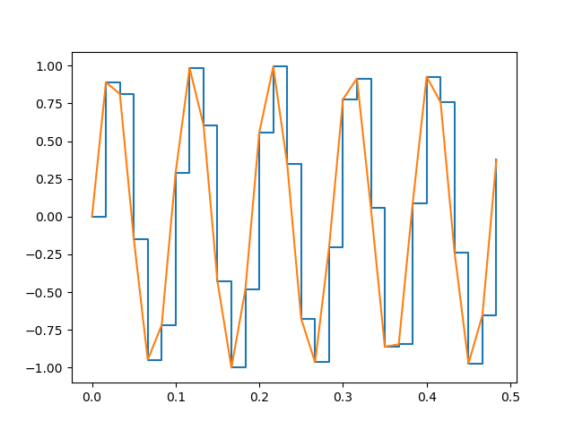

# pySampler
 This is a ADC/DAC simulator

## DAC
This a DAC simulator.

### Inputs:
    (time & signal)
    Period of the signal
    Number of bits
    SPAN
    Sample period

### Example output code: 
    ['0x7f', '0xff', '0x80', '0x0', '0x7f', '0xff', '0x80', '0x0', '0x7f', '0xff', '0x80', '0x0', '0x7f', '0xff', '0x80', '0x0', '0x7f', '0xff', '0x80', '0x0']

### Others examples

